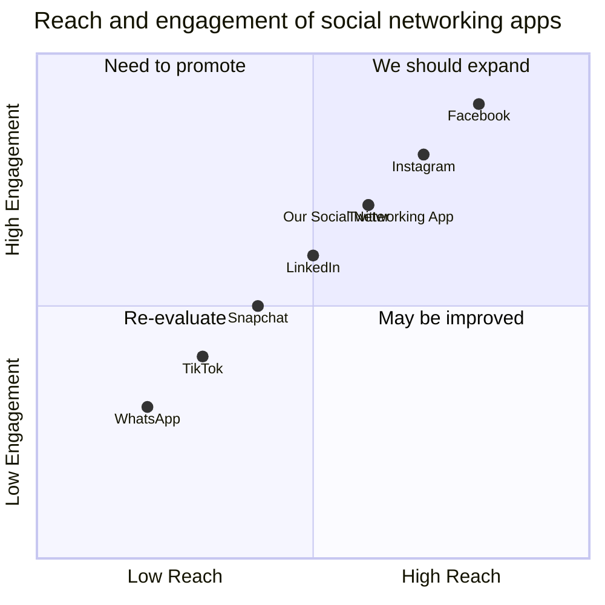

## Original Requirements:
The boss wants us to create a social networking app.

## Product Goals:
```python
[
    "Create a user-friendly social networking app",
    "Increase user engagement and retention",
    "Provide a seamless and enjoyable user experience"
]
```

## User Stories:
```python
[
    "As a user, I want to be able to create a profile and customize it with my personal information and profile picture",
    "As a user, I want to be able to connect with friends and family and share updates, photos, and videos",
    "As a user, I want to be able to discover and join groups and communities based on my interests",
    "As a user, I want to be able to like, comment, and share posts from other users",
    "As a user, I want to be able to receive notifications for new messages, friend requests, and activity in my groups"
]
```

## Competitive Analysis:
```python
[
    "Facebook: A popular social networking app with a large user base and a wide range of features",
    "Instagram: A photo and video sharing app with a focus on visual content",
    "Twitter: A microblogging platform that allows users to share short messages and updates",
    "LinkedIn: A professional networking app for connecting with colleagues and finding job opportunities",
    "Snapchat: A multimedia messaging app with a focus on ephemeral content",
    "TikTok: A short-form video app for creating and sharing entertaining content",
    "WhatsApp: A messaging app for sending text messages, voice messages, and making voice and video calls"
]
```

## Competitive Quadrant Chart:


## Requirement Analysis:
The product should be a user-friendly social networking app that allows users to create profiles, connect with friends and family, share updates, photos, and videos, discover and join groups and communities, like, comment, and share posts, and receive notifications for new messages, friend requests, and activity in groups.

## Requirement Pool:
```python
[
    ("User profile creation and customization", "P0"),
    ("Connect with friends and family", "P0"),
    ("Share updates, photos, and videos", "P0"),
    ("Discover and join groups and communities", "P1"),
    ("Like, comment, and share posts", "P1")
]
```

## UI Design draft:
The app will have a clean and modern design with a user-friendly interface. The main screen will have a navigation bar at the bottom for easy access to different sections of the app. The user profile page will allow users to customize their profile picture and personal information. The home feed will display posts from friends and groups, with options to like, comment, and share. The discover page will show recommended groups and communities based on the user's interests. Notifications will be displayed in a separate tab, and users will be able to easily send messages and friend requests to other users.

## Anything UNCLEAR:
There are no unclear points.