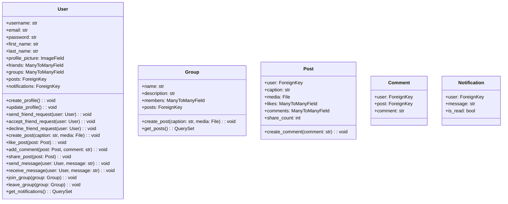
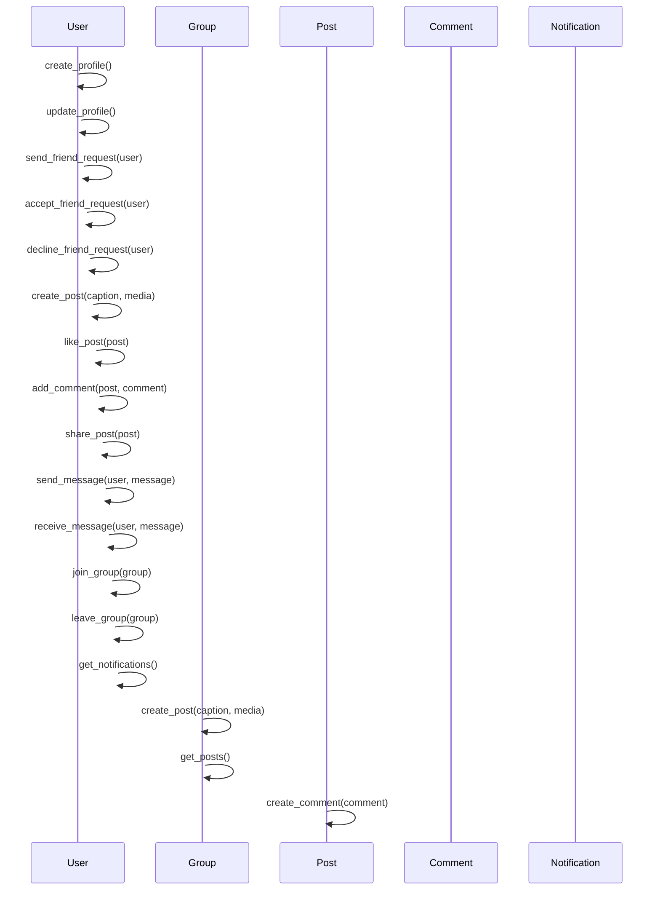

## Implementation approach:
To create a user-friendly social networking app, we will use the Django framework, which is a high-level Python web framework that follows the model-view-controller (MVC) architectural pattern. Django provides a robust set of tools and features for building web applications, including user authentication, database management, and template rendering.

For the frontend, we will use HTML, CSS, and JavaScript along with the Bootstrap framework to create a modern and responsive user interface. We will also use jQuery for client-side interactions and AJAX for asynchronous requests.

To handle user profiles, we will use Django's built-in User model and extend it with additional fields for personal information and profile pictures. We will also use Django's authentication system for user registration, login, and password reset functionalities.

For connecting with friends and family, we will implement a friend request system using Django's ManyToManyField to create a relationship between users. Users will be able to send friend requests, accept or decline requests, and view their list of friends.

To share updates, photos, and videos, we will implement a post model using Django's ORM. Users will be able to create posts, add captions and media files, and view posts from their friends and groups.

For discovering and joining groups and communities, we will create a group model using Django's ManyToManyField. Users will be able to search for groups based on their interests, join groups, and view posts from group members.

To like, comment, and share posts, we will implement these functionalities using Django's ORM. Users will be able to like posts, add comments, and share posts with their friends.

To handle notifications, we will use Django's signals to send notifications to users when they receive new messages, friend requests, or activity in their groups.

## Python package name:
```python
"social_networking_app"
```

## File list:
```python
[
    "main.py",
    "models.py",
    "views.py",
    "urls.py",
    "templates/",
    "static/",
    "media/"
]
```

## Data structures and interface definitions:


## Program call flow:


## Anything UNCLEAR:
The requirements are clear and there are no unclear points.